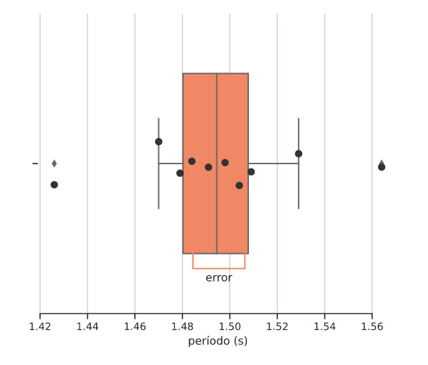

```{r setup, include=FALSE}
library(tufte)
library(tidyverse)
library(kableExtra)
library(ggplot2)
library(hrbrthemes)
library(viridis)
library(jmv)

# invalidate cache when the tufte version changes
knitr::opts_chunk$set(cache.extra = packageVersion('tufte'))
options(htmltools.dir.version = FALSE)
```

**Resumen:** En este informe se buscó identificar fuentes de errores sistemáticos y aleatorios en experiencias de laboratorio, intentando posteriormente mitigar los efectos que estos errores tienen en los resultados del experimento. Lo anterior se realizó en dos experiencias distintas, utilizando distintos métodos de tratamiento de errores, y finalmente se concluyó que en ambos casos se lograron mitigar satisfactoriamente los errores, tanto sistemáticos como aleatorios, pues los resultados de los experimentos se encontraron en un rango de valores esperados. Finalmente, se destaca la relevancia del análisis de errores en experimentos de carácter físico.

# Introducción
El objetivo principal de este laboratorio es identificar las fuentes de errores sistemáticos y aleatorios bajo distintas condiciones experimentales, intentando cuantificarlos bajo un modelo teórico de variable aleatoria. Se intentará predecir los errores, cuantificarlos e identificar sus causas si es posible.

Para cumplir este objetivo principal, se realizarán dos experimentos, cada uno midiendo magnitudes físicas distintas. En el primer experimento se buscará describir el error estadístico en la medición de la longitud de veinte objetos del mismo tipo (asumiendo un mismo largo). Se espera que las mediciones obtenidas tengan una desviación estándar menor a $1$ mm, considerando la precisión de una regla común y la precisión de fabricación de los objetos que se usarán. Como extensión de esa estimación, se espera^[El origen de esta estimación se explica en el marco teórico.] que el error estándar sea menor a aproximadamente $0.223$ mm.

Por otra parte, en el segundo experimento se medirá el período de oscilación de un péndulo en 10 ocasiones, y se compararán los valores obtenidos con el valor teórico del período. En este caso, se espera una desviación estándar menor a 100 ms, basándose en parte a estudios^[@hetzler_reliability_2008] similares sobre el error introducido por cronometraje manual. Adicionalmente, se espera que la estimación teórica no se desvíe de la medición experimental por más de 150 ms, ya que deben tomar en cuenta factores como el roce, largo de la cuerda del péndulo y el error humano.

Para ambos experimentos se espera la ocurrencia de distintos errores sistemáticos y aleatorios, los cuales puedan ser parcialmente mitigados para lograr que los resultados no se escapen de las expectativas de error.


## Marco Teórico
En experimentos físicos como este, es útil categorizar las posibles fuentes de error observacional, con tal de establecer formas de reducirlas o bien cuantificarlas como incertidumbre en los valores finales. A grandes rasgos, se pueden dividir los errores observacionales entre errores aleatorios y errores sistemáticos[@taylor_introduction_1997].

Los errores aleatorios corresponden a errores que llevan a valores inconsistentes o fluctuantes cuando se hace la misma medición, y usualmente se deben a la variabilidad en precisión de los instrumentos de medida en uso. Dada que la distribución de muestras frecuentemente se aproxima a una distribución normal, se puede compensar el error con varias muestras, mediante el promedio. Así, el error aleatorio se dispone para un análisis mediante métodos estadísticos inferenciales, y puede ser caracterizado como variable aleatoria por la distribución de la media de las muestras tomadas, una distribución muestral.

El efecto del error aleatorio se puede modelar[@altman_standard_2005] matemáticamente basándose en el hecho de que el promedio de la distribución de muestreo equivale al promedio de la distribución de las mediciones y la desviación estándar de la distribución muestral se define^[Donde $\sigma$ es la desviación estándar de la población y $n$ es el número de observaciones en la muestra. Dado que rara vez se conoce $\sigma$ es común estimarlo con la desviación estándar $s$ de las muestras, como se hará de acá en adelante.] como:

$${\sigma}_{\bar{x}} = \frac{\sigma}{\sqrt{n}}$$
Que por definición corresponde al error estándar de la media ($SEM$ o $S_E$), o simplemente error estándar, lo que describe que tan lejos puede estar el promedio de las mediciones del valor real.

Se puede utilizar esto para construir intervalos de confianza sobre la medición en sí, asumiendo que la distribución muestral sea normal^[Por el teorema del límite central se espera algo similar de la mayoría de otras distribuciones dado suficiente $n$.]. Para esto, se establece siguiente expresión:
$$ x^{\ast} = \overline{x} \pm z{\sigma}_{\bar{x}} $$
Donde $z$ corresponde al punto porcentual de la distribución normal^[Para este trabajo se tomará $z = 1$.]
En el caso de que la muestra sea muy pequeña, se calcula el promedio de las 2 medidas entre las cuales se encuentra la muestra, y se establece el rango de valores posibles de la siguiente manera:

$$l_{real} = \frac{x_1 + x_2}{2} \pm \frac{prec.}{2}$$
El uso de este método evitaría cualquier subjetividad al momento de definir el valor de una medición cuando la precisión de la herramienta que se esté usando para el experimento dado no sea suficiente para definir con exactitud la medida que se quiera buscar. 

Por otra parte, los errores sistemáticos son los errores que se producen debido a variaciones en las condiciones en las que se realiza el experimento, como por ejemplo, un cambio de la temperatura ambiente. 

Para mitigar los efectos causados por este tipo de error, se recomienda llevar a cabo un método con 3 pasos. Primero se identifican las posibles fuentes de error y como se pueden comportar, después se establece un orden de prioridad según el efecto estimado de cada error y finalmente se proponen tratamientos para reducir o eliminar el efecto de los errores prioritarios en el experimento.

# Montaje y procedimiento experimental
## Midiendo longitud
Dado que el objetivo general de este laboratorio es identificar y cuantificar errores sistemáticos y aleatorios, se decidió medir la longitud de 20 elementos del mismo tipo, para luego analizar estadísticamente los datos obtenidos, e identificar posibles fuentes de error. Los materiales utilizados en la experiencia fueron los siguientes:

  * $20$ brochetas de bambú (de $25.5$ cm según envase)
  * Regla metálica milimetrada
  * Bloque de madera

El procedimiento consistió en colocar cada brocheta junto a la regla encima del bloque de madera, para que así ambos objetos se encontraran alineados, eliminando el error asociado a una mala alineación de la regla con el extremo de la brocheta. Luego, se anotó en una hoja la medida (en metros) indicada por la regla, utilizando 3 cifras significativas, dada la precisión de la regla. Este proceso se realizó con cada una de las 20 brochetas. 

## Midiendo tiempo
Para cumplir los objetivos de este laboratorio, se decidió realizar una segunda experiencia. Esta consistió en medir el tiempo que toma un péndulo (de confección propia) en completar una oscilación al soltarlo con un ángulo inicial de $15°$, para luego realizar un análisis de error entre los valores teóricos y experimentales. 

Los materiales utilizados en este experimento fueron:

  * Hilo de 0,54 metros de longitud (medido con huincha milimetrada)
  * Golilla
  * Clavo
  * Papelógrafo
  * Marcador
  * Transportador
  
El procedimiento consistió de dos partes: la confección del péndulo y el registro de los tiempos de oscilación.

**Confección del péndulo:** Para construir el péndulo, primero se dispuso el clavo (que actuará como pivote) en una muralla, y se amarró la cuerda a este, mientras que en el otro extremo de la cuerda se ató la golilla. Luego, utilizando el marcador, en el papelógrafo se dibujó una línea vertical, y otra que la interseca a $\ang{15}$, según el transportador. Este papelógrafo se utilizó como guía para soltar el péndulo desde un ángulo inicial de $\ang{15}$.

**Registro de los tiempos de oscilación:** Para poder registrar los tiempos de oscilación de forma precisa (y mitigar el posible error humano), se utilizó una cámara de video que grabó todo el procedimiento. Una vez se coloca el péndulo a 15° de la vertical, este se deja caer para medir el tiempo que tarda en completar una oscilación. Una vez completada la oscilación, se detiene el péndulo, y se repite el procedimiento un total de $10$ veces.

# Resultados
Siguiendo el procedimiento experimental se obtuvieron los siguientes datos:

```{r echo = FALSE, message=FALSE}
longitudes <- read_csv("exp_longitud.csv")
filas_lon <- seq_len(nrow(longitudes) %/% 2)
tiempos <- read_csv("exp_tiempo.csv")
filas_tie <- seq_len(nrow(tiempos) %/% 2)
```

```{r echo=FALSE, message = FALSE}
kable(list(longitudes[filas_lon,1:2],  
           matrix(numeric(), nrow=0, ncol=1),
           longitudes[-filas_lon, 1:2]), 
      caption = "Resultados del experimento de longitudes.",
      label = "longitudes", format = "latex", booktabs = TRUE, linesep = "", format.args = list(decimal.mark = ',', big.mark = "'")) 
```
```{r echo=FALSE, message = FALSE}
kable(list(tiempos[filas_tie,1:2],  
           matrix(numeric(), nrow=0, ncol=1),
           tiempos[-filas_tie, 1:2]), 
      caption = "Resultados del experimento de períodos",
      label = "periodos", format = "latex", booktabs = TRUE, linesep = "", format.args = list(decimal.mark = ',', big.mark = "'")) 
```

# Análisis de resultados
## Midiendo longitud
Basándose en un análisis de los errores aleatorios presentados y habiendo controlado o despreciado el resto de los errores sistemáticos, se propone el siguiente análisis por variable aleatoria de las 20 muestras.
```{r longitudes, fig.margin = TRUE, fig.cap = "Histograma y densidad de los valores de longitud obtenidos.", fig.width=3.5, fig.height=3.5, echo=FALSE, cache=TRUE, message=FALSE, warning=FALSE, results='hide'}
longitudes_jmv <- readRDS("longitudes_jmv.rds")
jmv::descriptives(
    data = longitudes_jmv,
    vars = "Longitud (mm)",
    hist = TRUE,
    dens = TRUE,
    n = FALSE,
    missing = FALSE,
    mean = FALSE,
    median = FALSE,
    sd = FALSE,
    min = FALSE,
    max = FALSE)
```
Los resultados obtenidos presentan una desviación estándar de $0.553$ mm, lo que representa un $55.3\%$ de la precisión del instrumento utilizado, indicando que las múltiples muestras parecen haber reducido el error inherente al instrumento.

El hecho de que la desviación estándar sea menor a la precisión de la regla utilizada ($1$ mm) justifica el método estadístico utilizado, tomando varios valores secuencialmente con tal de mejorar la estimación progresivamente.

Finalmente, se calcula el error estándar ($S_E = {\sigma}_{\bar{x}}$) y el intervalo de confianza con $z = 1$, como se establece en el marco teórico:
\begin{align*}
  \overline{x} &= 249.9 \text{ mm}\\z
  s &= 0.553 \text{ mm}\\
  S_E &= \frac{s}{\sqrt{n}} = 0.12354\text{ mm}\\
  x^* &= 249.9 \pm 0.12354 \text{ mm}\\
\end{align*}

## Midiendo tiempo
Partiendo con predicciones teóricas utilizando la aproximación del ángulo pequeño^[Se basa en $\sin\theta \approx \theta$, con un error muy pequeño para $\theta \leq \ang{15}$] (ecuación abajo) al período de un péndulo, se estima que el periodo de oscilación del péndulo es de $1.474$ s, una estimación directamente dependiente de la aceleración de gravedad (asumida $\SI{9.8}{m/s^2}$) y la longitud del hilo, que se sabe que tiene un valor de $0.54$ m.

$$ T = 2\pi \sqrt{\frac{L}{g}} \approx \SI{1.474}{s}$$
```{r periodos, fig.margin = TRUE, fig.cap = "Gráfico de barras de los periodos obtenidos, con el intervalo $z = 1$.", fig.width=4.5, fig.height=4.5, echo=FALSE, cache=TRUE, message=FALSE}

```

Comparando el valor medido con el valor hipotético, se encuentra con una diferencia marginal de -0,021 s, lo que da un porcentaje de error de aproximadamente 1,4%, confirmando que la hipótesis experimental propuesta está dentro de los márgenes de error esperados. Adicionalmente, se calcula el error estándar como $0.011$ mm, el error promedio como $0.025$ mm y el intervalo representativo $1.495 \pm 0.011$ mm

Basándose en el análisis de error anteriormente hecho, se proponen otras correcciones que podrían mejorar la precisión en futuros experimentos. Se consideran errores corregibles como la elasticidad del hilo siendo utilizable, cuya reducción eliminaría ciertos errores asociados a la longitud y transmisión de fuerza.

Otra cosa que podría ayudar a mejorar la precisión de la medida del periodo del péndulo es construir de nuevo el péndulo de forma que no dependa de una muralla. Esto se debe a que el roce generado ocasionalmente entre la muralla y la golilla afecta ligeramente los resultados al momento de medir el tiempo de oscilación del péndulo. Eliminando la muralla eliminaría el roce, haciendo la medición más fiel a la predicción teórica.

Igualmente, se podría usar mejor equipamiento para medir el tiempo de oscilación del péndulo (mejor cámara y editor de video o sistemas basados en fotorresistencias). Esto eliminaría el tiempo de reacción en la ecuación, y mejora la replicabilidad.

Por último, para poder tener los resultados más cercanos al valor teórico calculado, se podría realizar el experimento en ausencia de aire, eliminando la pérdida de energía por roce del péndulo con el aire.

Luego de haber calculado todos los valores relevantes para este laboratorio, se puede apreciar que, comparando todos los resultados de las repeticiones del experimento con el valor teórico calculado, casi todos estos resultados son mayores al valor teórico, sin embargo son muy cercanos a este.

Si bien no se pudieron eliminar todas las fuentes de error, se logró mitigar o reducir el efecto de varios errores, lo que teóricamente se refleja en la cercanía y bajo error de las mediciones tomadas.

# Interpretación y discusión de resultados
> "Siempre estaremos sumidos en el error. A lo más que puede aspirar cada generación es reducir las barras de error un poquito, y añadir al cuerpo de información para el cual esas barras aplican. La barra de error es una visible e ineludible asesoría de la fiabilidad de nuestro conocimiento."
>
> `r tufte::quote_footer('--- Carl Sagan')`^[@sagan_1998]

A grandes rasgos, lo que se hizo fue diseñar un tratamiento comprensivo para uno de los pilares de la experimentación científica, la estimación de errores y la falta de certeza.

Para cada experimento, se propuso identificar todas las posibles fuentes de error, intentando mitigar los errores sistemáticos, mejorando el diseño experimental y considerándolos en el análisis. Una vez hechos los experimentos, se utilizaron los datos de múltiples repeticiones para mitigar las desviaciones causadas por los distintos errores aleatorios, calculando el error estándar con tal de estimar qué tan cercanas eran las estimaciones en comparación a la realidad.

Adicionalmente, en el segundo experimento se extendió el análisis y se compararon los resultados con las predicciones teóricas. Si bien dicha predicción asume múltiples aproximaciones, demostró tener una buena precisión, incluso dentro del intervalo estimado por el error aleatorio. No toda aproximación es creada igual, y esta demostró su valor mediante experimentación.

Este análisis y tratamiento de las faltas de certeza es clave, debido a que en la práctica es muy importante considerar los posibles puntos ciegos o errores introducidos por experimentación o aproximación teórica si se espera llevar nuevas estimaciones al mundo real. Las consecuencias de no entender la certeza detrás de las conclusiones hechas y estimaciones no son menores, causando afirmaciones erradas e incontables accidentes,  lo que resalta la importancia de dominar esta clase de análisis.

# Conclusión

Tras completar la experimentación y el tratamiento de los resultados, se pudo comprobar que las hipótesis formuladas fueron correctas; en el caso del primer experimento, la desviación estándar resultó ser de 0,553 mm, lo cual está dentro del intervalo esperado en la hipótesis (0 mm hasta 1 mm). Por lo mismo, el valor del error estándar calculado ($\approx 0.124$ mm) también se encuentra en el rango esperado ($0.223$ mm).

A su vez, en el segundo experimento, también se cumplieron las hipótesis propuestas. La desviación estándar de los resultados del experimento no fue mayor a 100 ms (36 ms), y el valor promedio de los resultados no superó una diferencia de más de 150 ms comparado con el valor teórico (21 ms).

La realización de ambos experimentos permite enfatizar la importancia de considerar de errores al momento de obtener resultados de los experimentos. Omitir estos errores, podría generar una gran diferencia entre los valores estimados y los reales, haciendo que estos no puedan ser considerados correctos, en el caso de que la diferencia sea muy grande.

A raíz de esto, también se enfatiza la imperativa de sistemáticamente identificar e intentar mitigar estos errores. A partir de ambos experimentos se concluye que el uso de los 3 pasos mencionados en el marco teórico (identificar, priorizar y tratar errores) para mitigar los efectos de un error sistemático es probablemente efectivo, debido a la precisión que se logró obtener en ambos experimentos, aunque se sugiere un estudio comparativo. Similarmente, el método estadístico para tratar el error aleatorio se considera exitoso considerando las desviaciones estándar y error conseguidos.