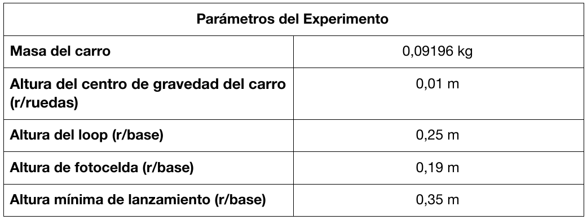
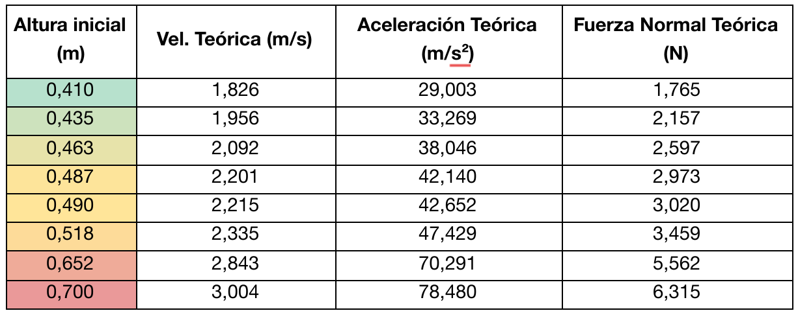

```{r setup, include=FALSE}
library(tufte)
library(kableExtra)

# invalidate cache when the tufte version changes
knitr::opts_chunk$set(cache.extra = packageVersion('tufte'))
options(htmltools.dir.version = FALSE)
```

**Resumen:** En este informe se buscó identificar y analizar el comportamiento de las distintas energías que pueden afectar a un objeto, específicamente la energía cinética y potencial gravitatoria. Junto a esto, se busca también entender cómo estas energías se relacionan con las fuerzas que el mismo objeto siente en distintas situaciones. Para esto, se creó una montaña rusa con un loop, donde se deja caer un carrito a distintas alturas, para que así, este tenga una energía inicial distinta en cada intento. Luego de haber experimentado, se logró determinar teórica y experimentalmente las condiciones necesarias para que el carrito logre dar una vuelta al loop, haciendo uso de conocimientos relacionados con conservación de energía y Segunda Ley de Newton. Finalmente, se concluyó que el diseño experimental fue acertado, pues los porcentajes de error entre valores teóricos y experimentales fueron bajos.

# Introducción
El objetivo de este laboratorio es lograr identificar y relacionar los distintos tipos de energías que puede tener un cuerpo, con las fuerzas que pueden estar interactuando con este. Junto a esto, también se busca relacionar cómo se transforman los distintos tipos de energías antes mencionadas, y cómo esto afecta al cuerpo en cuestión.

Para lograr cumplir los objetivos, se llevará a cabo la confección de una montaña rusa con un “loop”, sobre la cual se lanzará carrito. Este experimento es idóneo para esto, ya que se puede variar la altura desde la que se lanza el carrito, y ver cómo esto se ve reflejado en la velocidad en distintos puntos de la pista.

Teniendo esto en cuenta, también se tiene como objetivo encontrar una ecuación que relacione las energías y las fuerzas que están actuando en el experimento, para determinar las condiciones adecuadas que permitan que el auto pueda completar el loop de la montaña rusa.

Al momento de realizar el experimento, se espera que existan errores tanto sistemáticos como aleatorios, pero se estima que sus efectos no generarán un porcentaje de error mayor al 5% debido a las numerosas repeticiones y la precisión del sensor siendo utilizado. Debido a estos errores, se espera que la altura inicial necesaria para que una masa conocida de una vuelta al loop sin caerse sea de al menos 1,25 veces el diámetro del loop, en vez de 1 vez el diámetro.

## Marco Teórico

Este informe trata principalmente sobre la energía y sus transformaciones, por lo que es muy importante conocer el concepto de energía mecánica. La energía mecánica es la suma de las energías ligadas al movimiento, a la gravedad y a la elasticidad, sin embargo, para efectos de este trabajo se considerarán exclusivamente las primeras 2, pues en el experimento no se presenta energía elástica. Todas estas energías se miden en Joules [J], unidad caracterizada por: 
$$ \left[J\right] = \left[N\right] \cdot \left[m\right] $$
La energía que un cuerpo posee debido a su movimiento es denominada energía cinética, el trabajo necesario para acelerar el cuerpo a cierta velocidad. La ecuación que determina el valor de esta energía relaciona la masa del objeto, y su velocidad: 
$$ E_c = \frac{mv^2}{2} $$
En esta ecuación se puede apreciar que si la velocidad es nula, entonces la energía cinética del objeto es también nula.

Por otro lado, se tiene a la energía potencial ligada a la gravedad, llamada energía potencial gravitatoria. Esta expresión representa la energía a disposición del objeto debido a su posición relativa a un cuerpo gravitatorio, pudiendo ser transformada, por ejemplo, en energía cinética. La ecuación que permite calcular esta energía es equivalente al trabajo (fuerza * distancia) ejercido por la fuerza peso durante la distancia de caída h:

$$ E_p = m g \Delta h $$
$$ E_p = W \Delta h $$

Debido al principio de la conservación de la energía, la segunda ley de la termodinámica, en un sistema aislado no sujeto a fuerzas no-conservativas (como el roce), se espera que la suma de la energía cinética y la energía potencial gravitatoria se mantenga constante, entendido que la única transformación posible sería entre ambas formas de energía. Esta suma recibe el nombre de energía mecánica, y esta relación recibe el nombre del principio de la conversación de la energía mecánica:

$$E_m = E_c + E_p$$
$$\Delta E_k + \Delta E_g = 0$$
$$\Delta E_m = 0$$

Esta definición es de suma importancia, ya que servirá de base de todos los cálculos teóricos sobre este experimento.

Junto a la energía, también es necesario definir cómo actúan las fuerzas en la masa conocida cuando se está dando vuelta al loop, siendo la más importante la fuerza centrífuga.

La fuerza centrífuga es una fuerza ficticia que el objeto siente cuando cambia de trayectoria. Ya que en este caso se tiene un loop (circular), la masa conocida siempre estará afectada por esta fuerza, que puede ser representada como:

$$F_{cf} = m\cdot a_{cf} $$

A su vez, la aceleración centrífuga es equivalente al cuadrado de la velocidad tangencial, dividida en el radio de giro:

$$ A_{cf} = \frac{v_t^2}{r}$$

Con esto, se tiene una ecuación que permite calcular la fuerza centrífuga de un objeto que tiene trayectoria circular:
$$\sum F = m\cdot a_{cf} = m\cdot\frac{v^2}{r}$$
Junto a la fuerza centrífuga, se podrán encontrar en este experimento la fuerza peso, que relaciona la masa del objeto con la aceleración de gravedad y siempre apunta hacia abajo, y la fuerza normal, que es la fuerza que ejerce la superficie en sentido opuesto a la fuerza que el objeto aplica sobre ella, con la misma magnitud.

## Montaje y procedimiento experimental
Considerando el objetivo de identificar y relacionar la energía de un cuerpo con las fuerzas que interactúan con él, además de estudiar las transformaciones de energía, se realizará el montaje de una pequeña montaña rusa, para lo que se requerirán los siguientes materiales:

* Sistema de reticulado pasco - “Montaña rusa”
* Fotocelda
* Computador con programa “Capstone”

Para montar el sistema de reticulado de montaña rusa, se deberá anclar firmemente la estructura a un soporte universal, utilizando una pinza de nuez. La primera parte del experimento consiste en encontrar la altura mínima sobre el riel desde la cual el carro logra dar una vuelta completa al loop, para ello, primero calculamos teóricamente esta altura y soltamos el carro desde el reposo en el punto encontrado, posteriormente, se prueba con alturas cercanas hasta encontrar la menor altura experimental desde donde se logra el objetivo mencionado y se registra su valor.

Tras realizar esto, para la segunda parte del experimento se instala la fotocelda (que medirá la velocidad del carro) en la parte superior del loop y se conecta al computador utilizando un adaptador USB. Luego, usando el programa Capstone se configura la fotocelda seleccionando el sensor fotocelda y la lámina obturadora seleccionando la regleta con una constante de 0,01 metros. Una vez calibrado el sensor, se seleccionan 8 alturas en el riel sobre la altura mínima encontrada experimentalmente. Para cada altura, se registra su valor, se suelta el carro desde el reposo y se anota la velocidad del carro en la parte superior del loop medida por el programa. Se repite este procedimiento 5 veces para cada una de las 8 alturas con la finalidad de obtener datos más acertados. Finalmente, se registra la medida del radio del loop. 

```{r parametros, cache=TRUE, echo=FALSE, out.width="100%", dpi=300, fig.align="center"}

```

## Análisis de Errores
En este experimento fue posible encontrar varios errores que pueden generar varias diferencias entre los resultados reales y teóricos. Entre ellos está el error sistemático de la elección de la masa conocida. Para este experimento, se necesita que la masa conocida baje por la montaña rusa y logre completar un loop sin caerse, por lo que es necesario algo que pueda pasar por estos tramos de la montaña rusa perdiendo la menor cantidad de energía posible. Estas pérdidas de energía se pueden dar en este caso en la forma de roce entre la masa conocida y la superficie de la montaña rusa. Es por esto que la masa conocida es un carrito, ya que las ruedas reducen considerablemente (pero no del todo) la fricción generada.

Dado que la masa conocida ahora tiene ruedas, el centro de masa del carrito se encuentra más elevado que antes, específicamente a 1 cm de altura, por lo que este valor será considerado en el análisis de resultados.

Otro error sistemático que se debe considerar al momento de analizar los resultados del experimento, es la posición de la fotocelda que registra la velocidad del carrito. Esta fotocelda registra velocidades tangenciales respecto a su propia posición, pero la velocidad que resulta útil para este informe es la velocidad tangencial respecto del centro de masa del carrito, por lo que es necesario transformar los valores de la fotocelda para que resulten útiles para el análisis de resultados. La explicación de la ocurrencia de este error se verá en mayor detalle más adelante, al igual que su respectiva solución.

Un último error sistemático a considerar corresponde al error humano. Al momento de lanzar el carrito, es casi imposible que la persona que suelte el carrito lo haga desde el reposo absoluto. En otras palabras, es muy probable que al soltar el carrito, este cuente con una velocidad inicial no nula. Una posibilidad es que el carrito sea soltado con una velocidad en el sentido de bajada de la montaña rusa, en este caso, su energía mecánica inicial será mayor que en el reposo, pues tendría una energía cinética no nula. La otra posibilidad es que el carro se moviera ligeramente hacia arriba de la rampa, lo que provocaría un aumento en la energía potencial gravitatoria inicial, que se traduciría en una mayor energía mecánica (respecto al caso del reposo absoluto).

Por último, se tiene el error aleatorio de la precisión de la fotocelda, cuyo tratamiento se establece en el procedimiento experimental, mediante cinco repeticiones en cada altura.

## Análisis de Resultados
Partiendo desde el análisis teórico, es importante calcular los valores de las velocidades teóricas para poder compararlas con las velocidades reales.

Para calcular las velocidades teóricas se utilizará el principio de la conservación de la energía mecánica. Para el primer caso se tiene que el carrito parte del reposo (velocidad nula) a 0,410 m de altura:
$$ \Delta E_{m} = (E_{cf} + E_{pi}) - (0 + (0.09196 \cdot 9.81 \cdot 0.41)) = 0$$
$$E_{cf} + E_{pf} = 0.3698\,\si{\joule}$$
También se sabe que el radio del loop es de 0,125 m, pero, ya que el centro de masa del carrito se encuentra a 1 cm de altura, el radio se corrige a 0,115 m.

FIGURA

Es por esto que la altura a considerar para la energía potencial gravitatoria en la cima del loop será de 0,24 m:
$$ \frac{m\cdot v^2}{2} + m\cdot g \Delta h = 0.3698\,\si{\joule}$$
$$ \frac{0.09196 \cdot v^2}{2}+ 0.09196\cdot 9.81 \cdot 0.24 = 0.3698\,\si{\joule}$$
$$ v^2 = \frac{0.1533}{0.04598}\si{\metre\squared\per\second\squared} $$
$$ v = \SI{1.826}{\metre\per\second} $$
Con este cálculo hecho, se obtiene que la velocidad tangencial teórica del carrito en la cima del loop cuando este se deja caer desde 0,410 metros de altura es de 1,8259 m/s. 

Utilizando la fórmula de la aceleración centrífuga, se tiene que:
$$a_{cf} = \frac{v_t^2}{r}$$
$$a_{cf} = \frac{1.926^2}{0.115}$$
$$a_{cf} = \SI{29.003}{\metre\per\second\squared}$$

También, se puede crear un diagrama de cuerpo libre para el carrito en la cima del loop:

FIGURA

Relacionando este diagrama de cuerpo libre con la aceleración centrífuga y la fuerza centrífuga, se obtiene que:

$$\sum F = m\cdot a_{cf} = W + F_N$$
$$ 0.09196\cdot 29.003 = 9.81\cdot 9.09196 + F_N$$
$$ 2.6671 = 0.9021 + F_N$$
$$F_N = \SI{1.765}{\newton}$$

Repitiendo el mismo procedimiento que se hizo para este caso, se calcula la velocidad, aceleración y fuerza normal teórica de los 7 casos restantes. 
```{r fuerzayacel, cache=TRUE, echo=FALSE, out.width="100%", dpi=300, fig.align="center"}

```

Dado que a todas las velocidades el carrito logra dar una vuelta al loop sin caerse, es importante calcular teóricamente a qué velocidad mínima tiene que ir el carro sin que se caiga. Esto ocurre cuando en el equilibrio de fuerzas, la normal es nula, ya que esta fuerza siempre aparece cuando el objeto está en contacto con la superficie (sin normal, no hay contacto), por lo que se puede armar la siguiente ecuación:

$$m\cdot a_{cf} = W + F_N$$
$$ F_N \geq 0 \rightarrow m\cdot\frac{v_t^2}{r} - m\cdot g \geq 0 $$
$$\frac{v_t^2}{r} - g \geq 0 $$
$$ v_t \geq \sqrt{g \cdot r}$$
$$ v_t \geq \sqrt{9.81\cdot 0.115}$$
$$ v_t \geq \SI{1.062}{\metre\per\second}$$
Con esto se puede decir que la velocidad mínima que el carrito necesita para completar el loop es de 1,062 m/s cuando el carrito se encuentra en la cima del loop.

Con este valor se puede calcular también la velocidad mínima que debe tener el carrito al momento de entrar al loop (la velocidad en la cima del loop será representada por $v_f$, la velocidad que requiere el carro al iniciar el loop $v_i$, la altura inicial será $h_i$, la altura final será $h_f$, masa $m$ y la aceleración de la gravedad $g$):
$$ E_{ci} + E_{pi} = E_{cf} + E_{pf}$$
$$\frac{m v_i^2}{2} + m\cdot g \cdot h_i = \frac{m v_f^2}{2} + m\cdot g\cdot h_f$$
$$v_i \cdot 0.04598 + 0.009 = 0.0518 + 0.2165$$
$$v_i^2 = 5.639$$
$$v_i = \SI{2.374}{\metre\per\second}$$
Y con esta velocidad inicial mínima se puede calcular la altura mínima donde debe partir el carrito para lograr pasar el loop sin caerse, para esto, se utilizará la ecuación de conservación de energía nuevamente, considerando como situación inicial cuando se suelta el carrito, y como situación final cuando este llega a la base del loop:


$$ E_{ci} + E_{pi} = E_{cf} + E_{pf}$$
$$ 0 + m\cdot g \cdot h_i = \frac{mv^2}{2} + m\cdot g \cdot h_f$$
$$ g\cdot h_i = \frac{v_f^2}{2} + g h_f$$
$$ 9.81 \cdot h_i = \frac{5.639}{2} + 0.098$$
$$ h_i = 0.297 m $$
Comparando esta altura mínima teórica con la altura mínima real (0,35 m), se puede notar que existe un porcentaje de error del 15,14%, lo cual se explica por la presencia de los errores antes mencionados.
