```{r setup, include=FALSE}
library(tufte)
library(kableExtra)

# invalidate cache when the tufte version changes
knitr::opts_chunk$set(cache.extra = packageVersion('tufte'))
options(htmltools.dir.version = FALSE)
```

**Resumen:** En este informe se buscó medir las fuerzas que actúan sobre un objeto que se encuentra dentro de un elevador, mediante la realización de dos experimentos, uno en movimiento de subida y otro en bajada. Posteriormente, se analizaron los resultados obtenidos teniendo en consideración errores tanto sistemáticos como aleatorios, para lograr describir el fenómeno presenciado. Se formuló un modelo teórico fundamentado en la física newtoniana, utilizando las leyes de Newton y diagramas de cuerpo libre (DCL). Contrastando los valores teóricos y los experimentales para la fuerza normal en intervalos específicos se encuentra una alta concordancia con errores, dentro de la hipótesis propuesta.


# Introducción
El objetivo principal de este laboratorio es lograr identificar, caracterizar y medir las fuerzas que actúan constantemente sobre objetos cotidianos. También se busca obtener conclusiones sobre cómo se ven afectadas estas fuerzas bajo distintas condiciones, las cuales serán estudiadas mediante un experimento, el cual consiste en la confección de un elevador pequeño con una masa conocida dentro.

Un elevador es un buen modelo experimental para cumplir el objetivo propuesto, ya que en este existen varias fuerzas que actúan constantemente, y las magnitudes de estas fuerzas pueden ser fácilmente manipuladas, caracterizadas y analizadas. Además, ya que se puede colocar una masa conocida dentro del elevador, se puede también identificar las fuerzas que se transfieren del elevador a este, analizar cómo ocurre este fenómeno y cómo cambian las magnitudes de las fuerzas que afectan a la masa conocida.

Al momento de realizar este experimento se espera que el porcentaje de error se mantenga bajo el 5% al comparar los resultados reales y los valores teóricos. Esto porque se estima que se logrará mitigar los errores sistemáticos y aleatorios que puedan ocurrir durante la experimentación.

Dicho esto, también se espera que se logre identificar exclusivamente las fuerzas (que afectan directamente a la masa conocida) de peso y normal en el análisis teórico del experimento, y poder caracterizar mediante una ecuación como varían las condiciones de un objeto dentro del elevador cuando varían estas fuerzas.


## Marco Teórico

Este laboratorio se centra exclusivamente en la física newtoniana, tomando como punto de partida las tres leyes de Newton y en específico la segunda ley de Newton, también conocida como la Ley Fundamental de la Dinámica:

> "El cambio de movimiento es directamente proporcional a la fuerza motriz impresa y ocurre según la línea recta a lo largo de la cual aquella fuerza se imprime."
>
> `r tufte::quote_footer('--- Isaac Newton')`^[Newton, I. (1687). Philosophiæ naturalis principia mathematica. Pág. 199.]


De esta ley surge una ecuación vectorial que logra relacionar las variables de fuerza, masa y aceleración, de la siguiente manera:

$$ \sum F = m \cdot a $$

Esta ecuación permitirá calcular los valores teóricos a obtener en la experimentación, además de permitir determinar posibles fuentes de error en la realización del experimento.

Las fuerzas pueden dividirse en varios tipos, tales como la fuerza aplicada, peso, normal, roce, tensión, entre otros, pero para este laboratorio, se considerarán solamente las fuerzas de peso y normal, entendido que predominan el modelo físico.

La fuerza de peso es una fuerza que actúa sobre un cuerpo cuando este se somete a un campo gravitatorio. El vector de esta fuerza parte desde el centro de masa del cuerpo, y su dirección es hacia el centro del campo gravitatorio. Para este experimento, el campo gravitatorio surge del centro de la Tierra, por lo que se asume que la fuerza peso apunta siempre hacia abajo. La fuerza peso puede ser descrita en este caso como:

$$ W = m \cdot g $$

Por otro lado, se tiene la fuerza normal, producto del principio de acción y reacción (3.ª Ley de Newton) y es ejercida por la superficie en la que se encuentra un cuerpo. La fuerza normal tiene igual magnitud que la fuerza ejercida por el cuerpo, pero va en sentido contrario.

```{r fnormal, cache=TRUE, echo=FALSE, fig.align="center", out.width="30%"}
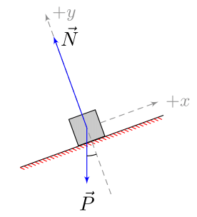
```

Ya que en este experimento se medirán distintas fuerzas que actúan sobre un mismo objeto, es necesario conocer el concepto de “Diagrama de Cuerpo Libre”, una representación gráfica de las fuerzas que actúan sobre un objeto particular. Esto nos permite facilitar el análisis de las fuerzas presentes en un sistema, el cual puede llegar a contar con muchos objetos. A continuación se presentan ejemplos de diagramas de cuerpo libre:

```{r diagramararo, cache=TRUE, echo=FALSE, out.width="80%", fig.align="center"}
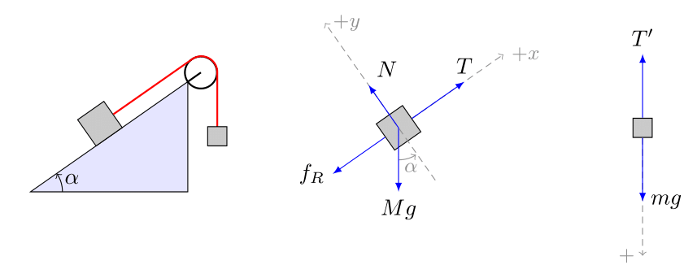
```

Como se puede observar en la imagen, todas las fuerzas identificadas en los diagramas de cuerpo libre de ambos objetos tienen un nombre. Esto es para poder diferenciar y caracterizar los distintos tipos de fuerzas, y así evitar confusiones. Por ejemplo, en este caso, “T” es una fuerza de tensión y “N” es una fuerza normal. A su vez, cada fuerza representada tiene flechas de distintos tamaños, lo cual indica la magnitud de cada fuerza. Una flecha más grande simboliza una fuerza de gran magnitud y viceversa. Por ejemplo, en el segundo diagrama de cuerpo libre, se puede observar que la fuerza peso (m2g) tiene mayor magnitud que la fuerza de tensión (T), por lo que el cuerpo descenderá con el paso del tiempo.

Finalmente, en el experimento se necesitará identificar intervalos de tiempo donde una cierta variable muestra un cambio lineal (en este caso, velocidad con aceleración constante), para lo que se usará el coeficiente de correlación de Pearson, que cuantificará la correlación lineal entre el tiempo y la variable escogida. La fórmula es la siguiente:

$$r_{x, y} = \frac{cov(x, y)}{\sigma_x\cdot\sigma_y}$$

Si se escoge un intervalo correctamente, se espera un $r$ muy cercano a $-1$ o a $1$.

# Montaje y procedimiento experimental
Dado el objetivo de querer lograr identificar distintas fuerzas que actúan sobre objetos cotidianos, es necesario llevar a cabo un experimento que logre mostrar de forma efectiva la interacción de objetos mediante fuerzas. Por lo anterior, se propone como experimento la confección de un elevador.

Para construir este elevador, se requerirán los siguientes materiales:

* Sistema de elevador reticulado pasco
* Soporte para masas
* 2 soportes universales
* 2 prensas
* 2 pinzas de doble nuez
* 1 barra metálica
* Cuerpo de masa aproximada de 0,5 kg
* Caja plástica con poliestireno expandido
* Sensor de movimiento rotacional pasco
* Celda de carga (balanza)
* Computador con programa “Capstone”
* Balanza digital
* Amplificador de carga “Pasco, Pasport-Load Cell Amplifier”

Para comenzar la construcción del elevador, se colocan los 2 soportes universales en el borde de una mesa, para luego fijarlos usando las prensas. Posteriormente, se instala la barra metálica de manera horizontal en los soportes universales, utilizando las 2 pinzas de doble nuez, de forma que quede un extremo de la barra fuera de la mesa. A continuación, se coloca la caja plástica con poliestireno expandido debajo del extremo de la barra que sobresale de la mesa, para evitar que se dañe el elevador al dejarlo caer y se ajusta el sensor de movimiento rotacional en un extremo de la barra horizontal. Luego, se abre el programa “Capstone” en el computador y se conecta el sensor rotacional a un adaptador, para luego conectarlo al PC por USB.

Por último, se calcula la masa del objeto que servirá como peso en el interior del elevador, y se coloca sobre el sostenedor. En este caso, la masa resultante fue de 0,4496 kilogramos. El sistema completo del elevador se cuelga por sobre la polea más externa del sensor rotacional.

Para registrar los resultados de cada repetición del experimento, se deberá utilizar el programa “Capstone” antes mencionado. Para evitar errores, es imperativo configurar correctamente el programa antes de iniciar el experimento, y así poder recibir datos de forma correcta.

Los parámetros que se deben ajustar en el programa sería el peso del elevador vacío, y luego del elevador con el objeto, seleccionar la fuerza que se registrará por el sensor rotacional (en este caso “fuerza 1”), y la frecuencia de muestreo, que será de 100 Hz^[Es importante hacer notar que los datos experimentales recibidos tienen una frecuencia de 20 Hz, contrario a las indicaciones previas.].

Para llevar a cabo el experimento, se debe tomar el extremo libre de la cuerda que une el elevador con el sensor rotacional, y tirar de ella, haciendo que suba el elevador. Para simular un descenso, se deja caer de forma controlada el elevador. En particular, se realizó el experimento en dos ocasiones (una de subida y otra de bajada) contando con una aceleración constante en el mismo sentido del desplazamiento y se registraron los resultados en el computador. 

# Resultados
La totalidad de datos experimentales utilizados y el código utilizado para generar los gráficos se pueden encontrar [**aquí.**](https://github.com/agucova/labs-dinamica/blob/main/set2/analisis.ipynb)

```{r vel, cache=TRUE, echo=FALSE}
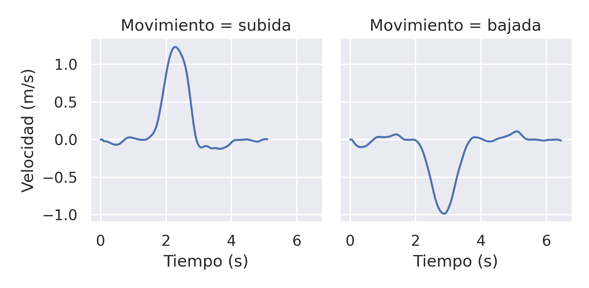
```
```{r fuerza, cache=TRUE, echo=FALSE}
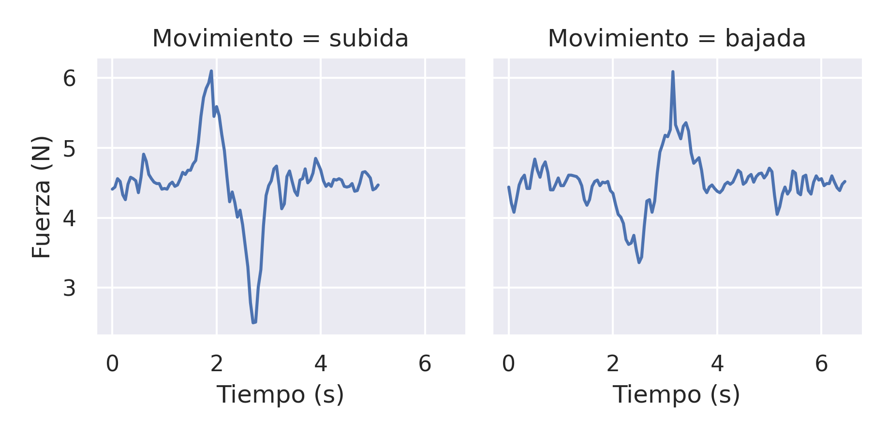
```
Adicionalmente, se computó numéricamente la aceleración basándose en los intervalos de velocidad:
```{r acel, cache=TRUE, echo=FALSE}
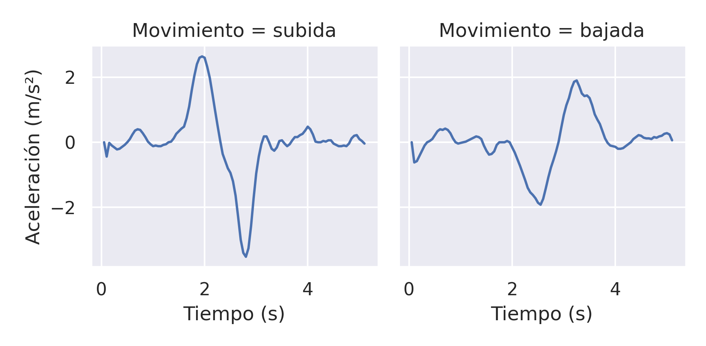
```

## Análisis de Errores
Uno de los errores que se pudo encontrar al momento de realizar el experimento, fue el error sistemático de la elección de la cuerda. Al no tener acceso a una cuerda ideal, es necesario escoger una cuerda que se ajuste a las necesidades del experimento. Para ello, la cuerda debe ser flexible, de modo que logre pasar correctamente por el sensor de movimiento rotacional, resistente para aguantar el peso del elevador, y no elástica, ya que el elevador podría variar su aceleración, debido a una pequeña oscilación generada por esta elasticidad. Esto se puede presentar al hacer movimientos bruscos con la cuerda, y afectará tanto a la subida del elevador como a la bajada, pero se estima que será más evidente cuando la aceleración del elevador sea mayor, ya que el elevador se desplazará de manera más pronunciada.

Este último punto es el más importante, ya que esta elasticidad no será detectada por el sensor de movimiento rotacional, debido a que la sección de cuerda que se estira y comprime está entre el sensor y el elevador. 

La cuerda que se usó en este experimento cumple con las 2 primeras condiciones, sin embargo, se cree que la elasticidad afectó los resultados obtenidos, debido a las pequeñas oscilaciones que se pueden observar en el gráfico de fuerza vs tiempo.

Un error detectado cuando se obtuvieron los resultados de ambas repeticiones del experimento fue el error aleatorio correspondiente al error humano al momento de manipular la cuerda. Al hacer esto, es casi imposible mantener una aceleración constante sin la ayuda de algún aparato. Esto se puede apreciar en el gráfico de velocidad vs. tiempo, donde claramente se puede notar que la variación de velocidad respecto del tiempo (en otras palabras, la aceleración) no es constante. 

Para mitigar los efectos de este error en los resultados del experimento, se decidió elegir un intervalo de tiempo donde la velocidad varíe a una tasa aproximadamente constante (o sea, en donde la función de velocidad es similar a una recta), y a partir de este intervalo, se calculó un valor cercano a la aceleración constante de la repetición del experimento.

El último error encontrado corresponde a un error sistemático que solo se hace presente cuando el elevador está subiendo. Este error corresponde al roce del aire con el peso dentro del ascensor. La fuerza de roce se opone al movimiento, por lo que cuando el elevador sube, el roce actúa hacia abajo, actuando sobre el techo del elevador y sobre el peso, y cuando el elevador baja, el roce actúa hacia arriba sobre el suelo del elevador. El problema se presenta cuando el elevador sube y el roce actúa sobre el peso. Esta fuerza de roce tiene que ser contrarrestada por la normal, la cual es una fuerza que va en sentido contrario, aumentando la magnitud de esta, y así alterando los valores registrados por la balanza. 

Para mitigar este error, se utilizó una masa conocida de poco volumen, para así tener menos contacto con el aire. Aunque el error no fue eliminado, de todas maneras se mejorará la precisión de los resultados del experimento. Aun así, es posible eliminar completamente este error, creando otro elevador completamente sellado haciendo que todo el roce sea experimentado sobre el elevador (donde no puede ser detectado por la balanza) y no sobre la masa conocida.

# Análisis de Resultados

Desde el punto de vista teórico del experimento, es importante señalar 4 casos fundamentales, donde el elevador está sometido a diversas condiciones.

## Caso 1: En reposo
En este caso, el elevador tiene una velocidad y aceleración nula. Por la segunda ley de Newton antes mencionada, la sumatoria de fuerzas es igual a la multiplicación entre masa y aceleración, pero, ya que la aceleración es nula, entonces la sumatoria de fuerzas es 0:
$$ \sum F = m\cdot g $$
$$ \sum F = m\cdot 0 $$
$$ \sum F = 0 $$
Por otro lado, en el sistema hay solo 2 fuerzas que actúan directamente sobre la persona: la normal y el peso. A partir de esto, se procede a hacer en diagrama de cuerpo libre de la persona en el elevador:
```{r reposo, cache=TRUE, echo=FALSE, fig.align="center", out.width="30%"}
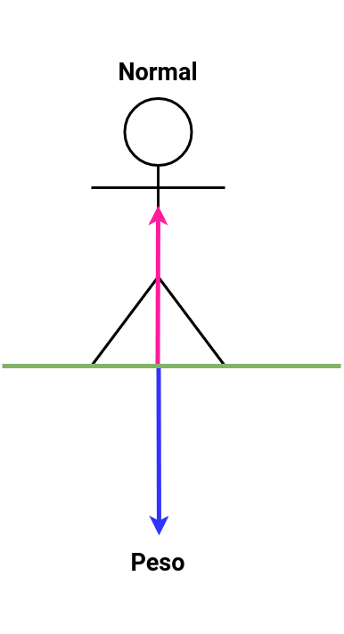
```
Con esto, se puede decir que la sumatoria de fuerzas en el eje vertical es la suma de las fuerzas normal y peso:
$$ \sum F = F_N - W $$
Considerando que anteriormente determinamos que la sumatoria de fuerzas es nula, se tiene que:
$$ \sum F = F_N - W = 0 $$
$$ F_N = W $$
A partir de la última parte de esta ecuación se puede deducir que la fuerza que registra la balanza ubicada dentro del elevador corresponde al peso real de la masa conocida, pues la fuerza normal cuenta con la misma magnitud que la fuerza peso.

## Caso 2: Desplazamiento con velocidad constante
Cuando se mueve el elevador con una velocidad constante, la aceleración, al igual que el caso anterior, es nula, por ende, el análisis es similar al caso en que el elevador se encuentra en reposo. Aplicando segunda Ley de Newton se tiene que:
$$ \sum F = m\cdot a$$
$$ \sum F = m\cdot 0 $$
$$ \sum F = 0$$
Luego, las únicas fuerzas que actúan en este caso son el peso y la normal, por lo que, considerando la coordenada positiva hacia arriba, se tiene que:
```{r reposo2, cache=TRUE, echo=FALSE, fig.align="center", out.width="30%"}

```
$$ \sum F = F_N - W = 0 $$
$$ F_N = W $$
Por lo tanto, se concluye lo mismo que en el caso anterior: el peso registrado de la masa conocida no se ve alterado.

## Caso 3: Desplazamiento hacia arriba con aceleración constante
En este caso, se tiene que el elevador tiene velocidad positiva, y aceleración constante positiva, por lo que, al contrario que los 2 casos anteriores, se tiene que la sumatoria de fuerzas no es nula. Es por esto, que es correcto tomar en cuenta la segunda ley de Newton como:

$$ \sum F = m\cdot a $$
También, la masa conocida en el elevador ahora tiene 3 fuerzas involucradas: la normal, el peso y la fuerza de inercia (fuerza que aparece a raíz de la segunda ley de Newton):
```{r acelpositiva, cache=TRUE, echo=FALSE, fig.align="center", out.width="30%"}
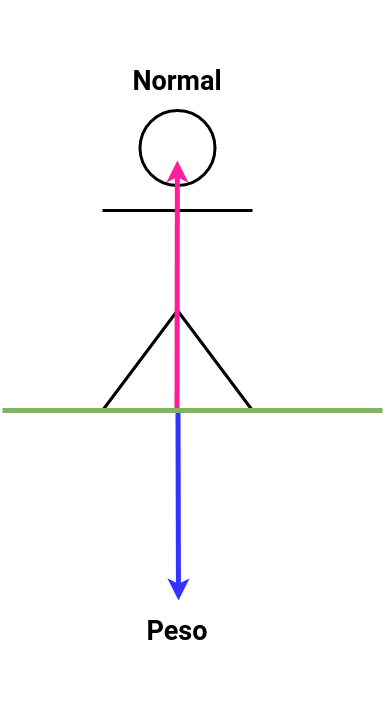
```
$$\sum F = F_n - W \neq 0 $$
Por lo que, juntando la primera ecuación con la anterior tenemos que:
$$\sum F = F_N - W = m\cdot a$$
Con esto se puede despejar la ecuación
$$ m\cdot a = F_N - m\cdot g$$
$$ F_N = m\cdot a + m\cdot g$$
$$ F_N = m\cdot{\left(a + g\right)} $$
Esta última parte de la ecuación es de suma importancia, ya que permite calcular la fuerza que registrará la balanza a cualquier aceleración que tenga el elevador. También cabe mencionar que siempre que la aceleración del elevador sea positiva, el peso registrado por la balanza será mayor al peso de la masa conocida.

En particular, si el elevador contara con una aceleración positiva de módulo g (aceleración de gravedad), se tendrá que:
$$ F_N = m\cdot\left(g + g \right) $$
$$ F_N = 2 W $$
Es decir, la balanza mostrará un valor equivalente al doble de la masa del objeto.

## Caso 4: Desplazamiento hacia abajo con desaceleración constante

Por último, se encuentra el caso en que el elevador se desplaza hacia abajo, con una aceleración constante en el mismo sentido que el desplazamiento. Si se considera un sistema de referencia en que la dirección positiva sea hacia arriba, se tiene que en este caso particular la aceleración del sistema es negativa. Si se aplica la segunda Ley de Newton:
$$ \sum F = m\cdot a$$
Y dado $a < 0$, tenemos que $\sum F < 0$.

Además, se sabe que sobre la masa se encuentran presentes 3 fuerzas; el peso, la normal y la fuerza de inercia (proveniente de la segunda Ley de Newton), y, siguiendo el mismo procedimiento que en el caso anterior, se tiene que:
```{r acelnegativa, cache=TRUE, echo=FALSE, fig.align="center", out.width="30%"}
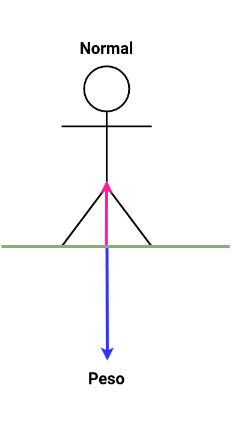
```
$$ \sum F = F_N - W = m\cdot a$$
$$ m \cdot a = F_N - m\cdot g$$
$$ F_N = m\cdot a + m\cdot g $$
$$ F_N = m\cdot\left(a + g\right) $$
Con esto se puede concluir que, ya que la aceleración del elevador es negativa, entonces la sumatoria de fuerzas o la suma de la normal y el peso, es negativa y dado que el peso no se ve afectado por la aceleración del elevador (depende de la masa del objeto), entonces para que la sumatoria sea verdadera, la normal debe disminuir, lo cual es correcto con la ecuación resultante, con una normal menor al peso provocando una aceleración negativa. En otras palabras, si la aceleración es negativa, entonces el peso medido por la balanza (que en verdad es representante de la fuerza normal) será siempre menor al peso real de la masa conocida.

A modo de ejemplo, si el ascensor se deja caer libremente (sujeto a la aceleración de gravedad), se tendrá que:

$$ F_N = m\cdot\left(-g + g\right) $$
$$ F_N = 0 $$

Por lo tanto, la balanza no registraría el peso del objeto en cuestión.

Habiendo analizado los 4 casos anteriores, se puede concluir que la fuerza normal tendrá un valor máximo si el elevador se desplaza hacia arriba con aceleración constante, y un valor mínimo de 0 si el elevador cae libremente, o con una aceleración hacia abajo de mayor magnitud que la aceleración de gravedad.

Ahora pasando a analizar los datos experimentales como tal, tenemos que en la primera serie se recreó la subida del elevador, tirando del hilo que pasa por el sensor de movimiento rotacional, permitiendo registrar la velocidad de este.

La total de la medición duró 5,1 segundos, pero el periodo donde el elevador está subiendo (en otras palabras, el tiempo donde los resultados obtenidos son relevantes para este informe), debe ser calculado utilizando la fórmula relacionada con los errores aleatorios tratados en el informe 0:

$$ I_{real} = \frac{t_1 + t_2}{2} \pm \frac{\text{prec.}}{2} $$

Para este experimento, se considera que el elevador empieza a subir cuando su velocidad cambia de signo negativo o nulo, a signo positivo y solo si este cambio de signo da lugar a la fluctuación más grande del registro. Se siguió un proceso similar para determinar el tiempo de término de la subida del elevador. Se buscó la primera vez donde la velocidad cambia de signo positivo a signo negativo o nulo en la fluctuación, ya que es en este momento donde el elevador empieza a descender de nuevo.

Utilizando esta fórmula y la explicación anterior, se tiene que el tiempo de inicio de la subida del elevador se encuentra entre 1,375 ± 0,025 s, y el tiempo donde el elevador deja de subir se encuentra entre 2,925 ± 0,025 s.

En este intervalo de tiempo, se tiene que encontrar un sub-intervalo donde la aceleración sea constante (o sea, donde la velocidad aumenta linealmente) para hacer nuestro análisis posterior.

Mediante observaciones gráficas, se propuso un intervalo entre 1,8 s y 2,05 s (ambos incluidos), constituido por 6 mediciones. Para justificar la elección del intervalo, se graficó los datos en cuestión y se construyó una regresión lineal sobre la velocidad para asegurar que sea un buen modelo.

```{r pintervalo, cache=TRUE, echo=FALSE, out.width="65%", fig.align="center"}
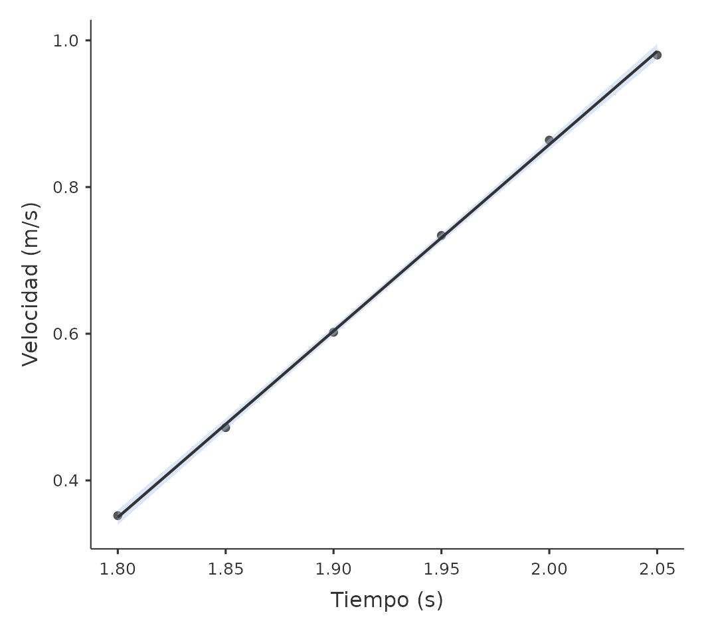
```

Evaluando el modelo, se consiguió un $r$ de Pearson de 0,99982, indicando una muy alta correlación lineal, perfecto para el propósito de este informe.

Después, se despejó la siguiente fórmula cinemática para determinar la aceleración en el intervalo:
$$ v_f = v_i + a\cdot\Delta{t} $$
Obteniendo una aceleración de 2,512 $m/s^2$.

Utilizando este valor, se puede calcular la fuerza normal que en teoría debería registrar la balanza en el elevador, utilizando la fórmula obtenida anteriormente para el caso en que el elevador sube con una aceleración constante. 

$$ F_N = \SI{0.4496}{\kilo\gram} \cdot \left(\SI{2.512}{{\metre\per\second}\squared} + \SI{9.81}{{\metre\per\second}\squared}\right) $$
$$ F_N = \SI{5.539}{\newton} $$
Por otro lado, gracias a los resultados registrados por la balanza dentro del elevador, se puede calcular la fuerza normal real, para luego compararla con la fuerza normal teórica.
Los valores registrados por la balanza en el periodo de tiempo con aceleración constante fueron:
TABLA
TABLA
Para calcular el valor de la fuerza normal, se calculó el promedio de los 6 valores registrados por la balanza en este intervalo, llegando a una fuerza de 5,73 N.

Se puede apreciar que hay una diferencia de 0,191 N comparando el valor teórico con el real (la balanza siente alrededor de 19 gramos más de lo que debería). Esto se debe a la presencia de los errores mencionados anteriormente, los cuales, debido a su naturaleza, deberían aumentar los valores registrados por la balanza.

Respecto a la segunda repetición del experimento, se simuló un descenso del elevador, dejándolo caer de forma controlada.

Esta repetición duró un total de 6,45 segundos, pero, al igual que el caso anterior, solo un fragmento de este tiempo es relevante para este informe.

Utilizando el mismo procedimiento utilizado para la repetición anterior, se determinó el punto de inicio cuando la velocidad pase de un valor positivo o nulo a un valor negativo, y el punto de término cuando la velocidad pasa de un valor negativo a un valor positivo o nulo.

De esta forma se tiene que el intervalo de tiempo donde parte el descenso del elevador es 1,675 ± 0,025 s, y el intervalo donde termina el descenso es 3,675 ± 0,025 s.

Utilizando el mismo razonamiento que en la repetición anterior, se determinó que el intervalo donde la aceleración del elevador es aproximadamente constante, es entre los 2,3 s y los 2,6 s, teniendo un $r$ de Pearson de -0,99934.
```{r sintervalo, cache=TRUE, echo=FALSE, out.width="65%", fig.align="center"}
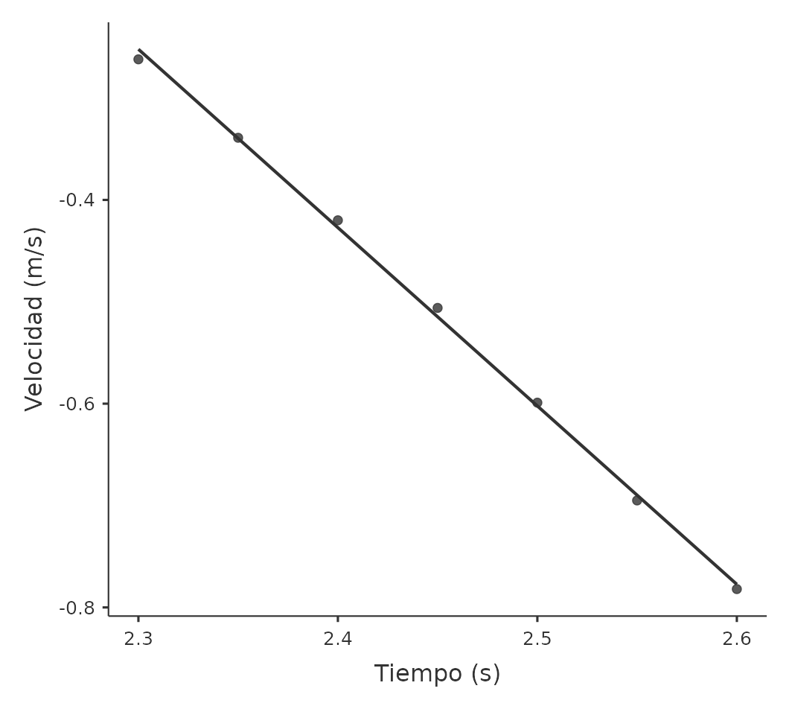
```

Nuevamente, se calculó que la aceleración en este intervalo de tiempo es de $\SI{-1.733}{{\metre\per\second}\squared}$.

Con este valor, se calcula la fuerza normal teórica:
$$ F_N = \SI{0.4495}{\kilo\gram} \cdot\left(\SI{-1.733}{{\metre\per\second}\squared} + \SI{9.81}{{\metre\per\second}\squared}\right)$$
Ya teniendo la fuerza normal teórica, se calcula la fuerza normal real utilizando el mismo método que en la primera repetición.
```{r tabl1, cache=TRUE, echo=FALSE, out.width="45%", fig.align="center"}
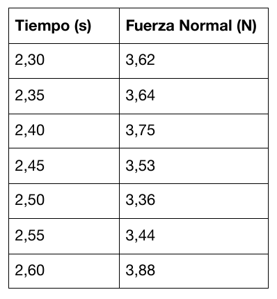
```

```{r tabla2, cache=TRUE, echo=FALSE, out.width="60%", fig.align="center"}

```
Luego de calcular el promedio de todas estas fuerzas, se tiene que el valor de la fuerza normal real es de $3.602$ N, siendo un valor muy fiel al valor teórico (la balanza registra solo $2.8$ g menos de lo que debería). Esto probablemente se debe a la poca cantidad y baja intensidad de los errores que pueden afectar a los resultados cuando el elevador va en descenso.

# Interpretación y Discusión de Resultados
Respecto a las estimaciones teóricas, específicamente partiendo de los diagramas de cuerpo libre, es importante señalar que existen patrones que se repiten constantemente que determinan los cambios de las condiciones de la masa conocida. El patrón consiste en que en cualquier caso, mientras haya aceleración distinta de 0, la balanza dará resultados distintos al peso real de la masa conocida. Esto significa que para la masa no es relevante si se tiene velocidad positiva, nula o negativa. 

```{r tabla3, cache=TRUE, echo=FALSE, out.width="100%", fig.align="center"}
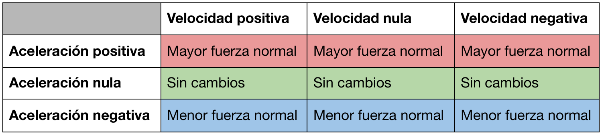
```

Respecto a los gráficos de resultados, el gráfico de velocidad vs. tiempo resultó ser fundamental, ya que gracias a esto se logró calcular el valor aproximado de la aceleración y mediante esta llegar a los valores teóricos para las fuerzas. Con esto, se logró armar una ecuación que relaciona todas estas variables, que estima teóricamente para cualquier caso el valor que registrará una balanza dentro de un elevador.

$$F_N = m\cdot\left(a + g\right)$$
Volviendo a los diagramas de cuerpo libre, en el análisis de resultados, se hizo estos diagramas a 4 casos distintos que resultan ser relevantes para este informe, pero en la tabla anterior se muestra que existen 9 tipos de casos distintos que puede tener el elevador. Por ejemplo, el diagrama de cuerpo libre no se hizo para los casos en que se esté frenando (velocidad y aceleración tienen distinto signo). Esto se debe por la conclusión sacada de los primeros párrafos de este ítem: para los aspectos relevantes de este informe, nada depende de la velocidad como tal, sino que lo importante es su variación respecto del tiempo, o sea, su aceleración.

Regresando al ejemplo del frenado, en ese caso el diagrama de cuerpo libre sería equivalente al de los casos 3 y 4, dependiendo si la aceleración es positiva o negativa, respectivamente.

# Conclusión
Desde el punto de vista teórico, se logró modelar el sistema en distintas situaciones, describiéndolo matemáticamente, lo que permitió concluir que la fuerza normal no dependía de la velocidad, sino que de la aceleración del elevador en un momento determinado.

También se logró exitosamente aislar intervalos donde la velocidad es constante, y estimar la fuerza normal a partir de estos, comparándolos con los valores teóricos que yacen del análisis previo por Diagramas de Cuerpo Libre (DCL). Se observa una concordancia entre el modelo teórico basado en física newtoniana y los dos experimentos presentados, dentro de un margen de error razonable mencionado en la hipótesis.

Tras realizar la experimentación y el análisis de resultados, se pudo determinar el cumplimiento de las hipótesis planteadas, pues en ambos experimentos el porcentaje de error entre la fuerza normal teórica y la experimental fue menor al 5% (3,3% en la subida, 0,8% en la bajada) y en ambos casos se logró identificar y caracterizar las fuerzas peso y normal.

